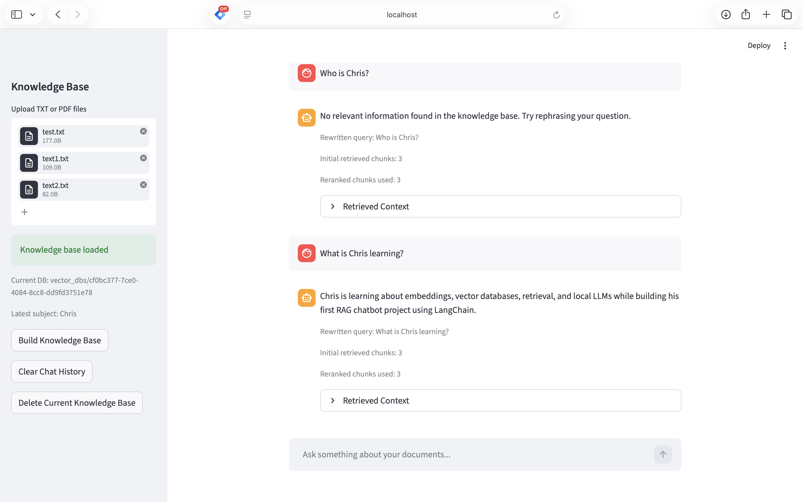

# 🤖 Local RAG AI Assistant

A **local Retrieval-Augmented Generation (RAG) chatbot** built with **LangChain, Ollama, and Streamlit**.

This project enables users to upload documents and ask questions, with answers strictly grounded in the provided knowledge base — reducing hallucination and improving reliability.

---

## 📸 Demo



---

## 🚀 Features

- 📄 Upload TXT / PDF documents  
- 🔍 Semantic search using vector database (Chroma)  
- 🧠 Query rewriting with pronoun resolution  
- 📊 Reranking for improved retrieval quality  
- 🤖 Local LLM (Ollama) for answer generation  
- 🖥️ Interactive UI built with Streamlit  
- 🔒 Strict grounding to prevent hallucination  

---

## 🧱 System Architecture

```text
User
↓
Streamlit Frontend
↓ HTTP Request
FastAPI Backend
↓
RAG Pipeline
├── Query Rewrite
├── Chroma Vector Retrieval
├── Reranking
├── Prompt Construction
└── LLM Factory
    ├── Ollama (local)
    └── OpenAI / Groq / Together (planned)
↓
Answer + Retrieved Context
```

---

## 🛠️ Tech Stack

- Python  
- LangChain  
- Ollama (Local LLM)  
- Chroma Vector Database  
- Streamlit  
- SentenceTransformers  

---

## 📂 Project Structure

```text

rag-chatbot-demo/
├── app/
│   ├── pipeline/
│   │   ├── rewrite.py
│   │   └── prompt.py
│   ├── retrieval/
│   │   ├── retriever.py
│   │   └── reranker.py
│   └── utils/
│       └── logger.py
├── backend/
│   ├── main.py
│   ├── schemas.py
│   ├── rag_pipeline.py
│   ├── vector_store.py
│   ├── document_service.py
│   └── llm_factory.py
├── frontend_app.py
├── web_app.py
├── requirements.txt
├── screenshot.png
└── README.md
```

---

## 🔌 API Endpoints

```text
GET  /health
POST /chat
POST /upload

```

### POST /chat

Request:

```json
{
  "question": "What is Chris learning?"
}

```

Response:

```json

{
  "answer": "...",
  "rewritten_query": "...",
  "initial_retrieved_chunks": 8,
  "reranked_chunks_used": 3,
  "sources": ["..."]
}

```

### POST /upload

Uploads a TXT or PDF file and builds a new Chroma vector database.

---

## ⚙️ How to Run

### 1. Create virtual environment

```bash
python3 -m venv .venv
source .venv/bin/activate
pip install -r requirements.txt
```

### 2. Configure environment variables

Create a `.env` file:

```env
LLM_PROVIDER=ollama
OLLAMA_MODEL=llama3.2
```

### 3. Start Ollama

```bash
ollama serve
ollama pull llama3.2
```

### 4. Start FastAPI backend

```bash
uvicorn backend.main:app --reload
```

Backend API docs:

```text
http://127.0.0.1:8000/docs
```

### 5. Start Streamlit frontend

```bash
streamlit run frontend_app.py
```

---

## 🎯 Key Highlights

- Built a **RAG pipeline from scratch**  
- Implemented **query rewriting with pronoun resolution**  
- Designed a **retrieval + reranking pipeline**  
- Applied **strict grounding to reduce hallucination**  
- Structured code in a **modular, production-like architecture**  

---

## 📌 Future Improvements

- Hybrid query rewriting (rule-based + LLM)  
- Multi-document context reasoning  
- Deployment (Streamlit Cloud / Docker)  
- RAG evaluation metrics (retrieval quality, answer accuracy)  

---

## 🐳 Docker Setup

This project supports Docker-based local development with separate frontend and backend containers.

### Architecture

```text
Browser
↓
Streamlit Frontend Container
↓ HTTP
FastAPI Backend Container
↓
RAG Pipeline
↓
Chroma Vector Store
↓
Local Ollama via host.docker.internal
```
### Run with Docker

Make sure Ollama is running locally:

```bash
OLLAMA_HOST=0.0.0.0:11434 ollama serve
```

Then start the application:

```bash
docker compose up
```


Frontend:
```text
http://localhost:8501
```

Backend API docs:

```text
http://localhost:8000/docs
```


### Notes

The backend connects to local Ollama using:

```text
http://host.docker.internal:11434
```

This allows Docker containers to access the Ollama service running on the host machine.
---

## 👨‍💻 Author

**Zhipeng L